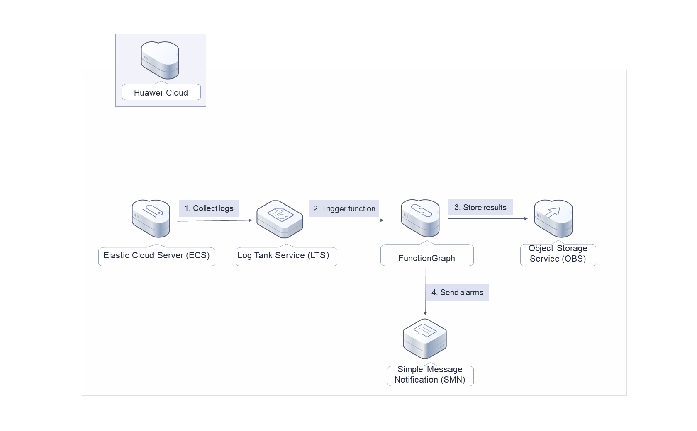
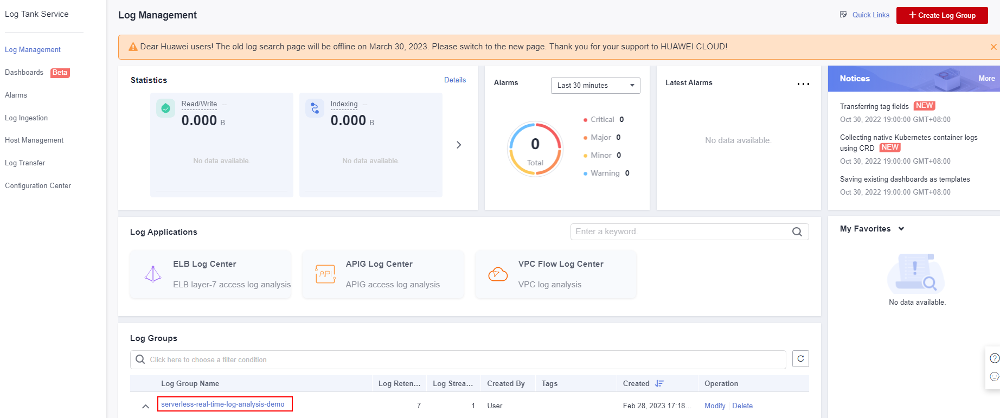
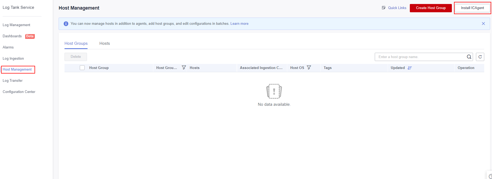
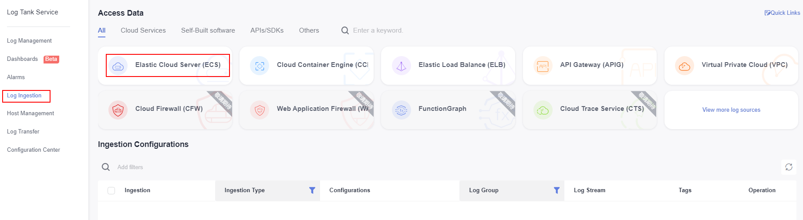
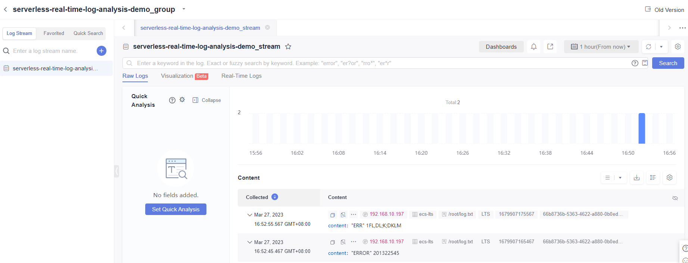
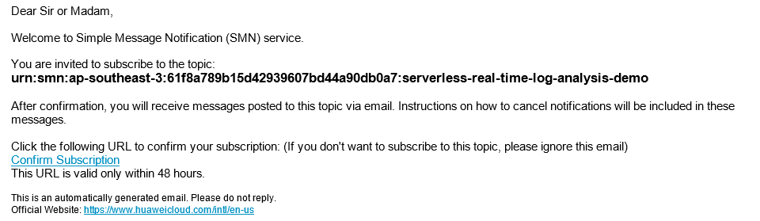
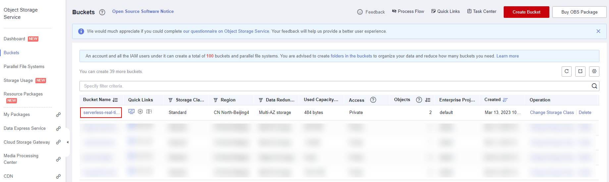
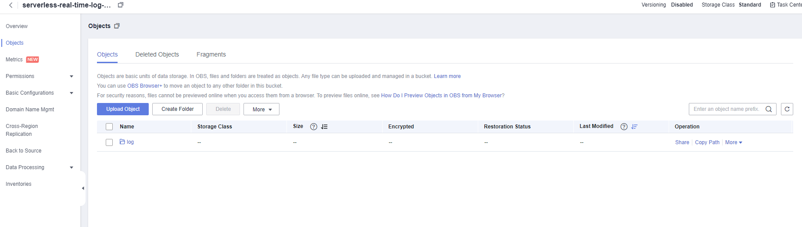

[TOC]

**Solution Overview**
===============
This solution helps you collect, analyze, and archive Elastic Cloud Server (ECS) logs with a serverless architecture. It uses Log Tank Service (LTS) to collect ECS logs, FunctionGraph LTS trigger to obtain logs and analyze alarms in logs, Simple Message Notification (SMN) to push alarms to users, and Object Storage Service (OBS) to archive alarms.

For more details about this solution, visit: https://www.huaweicloud.com/intl/en-us/solution/implementations/srtla.html

**Architecture**
---------------


**Architecture Description**
---------------
This solution will:
- Create an OBS bucket to store alarm logs.
- Create a FunctionGraph function.
- Create an SMN topic to push alarms in logs.
- Create an LTS log group and log stream to manage collected logs.

**File Structure**
---------------

``` lua
huaweicloud-solution-serverless-real-time-log-analysis
├──serverless-real-time-log-analysis.tf.json -- Resource orchestration template
├──functiongraph
	├──serverless-real-time-log-analysis.py -- Function file


```
**Getting Started**
---------------

1. Log in to the [LTS console](https://console-intl.huaweicloud.com/lts/?region=ap-southeast-3&locale=en-us#/cts/manager/groups), and view the created log group and log stream.

	Figure 1 LTS console

	

2. Choose Host Management and click Install ICAgent. For details, see [Installing ICAgent](https://support.huaweicloud.com/intl/en-us/qs-lts/lts_0829.html).

	Figure 2 Installing an ICAgent

	

3. Choose Log Ingestion and click Elastic Cloud Server (ECS). For details, see [Ingesting Logs to Log Streams](https://support.huaweicloud.com/intl/en-us/qs-lts/lts_08302.html).

	Figure 3 Ingesting logs

	

4. Choose Log Management, click the created log group, and view the collected logs in the Content area.

	Figure 4 Viewing logs

	

5. Log in to the mailbox for receiving alarms, and click Confirm Subscription to receive collected alarms.

	Figure 5 Viewing logs

	

6. Log in to the [OBS console](https://console-intl.huaweicloud.com/obs/?agencyId=WOmAijZnbElNjCFzTVDl4aJQAgdaTUMD&region=ap-southeast-3&locale=en-us#/obs/manager/buckets) and click the created OBS bucket to view alarm logs.

	Figure 6 Viewing logs

	

	Figure 7 Viewing logs

	

